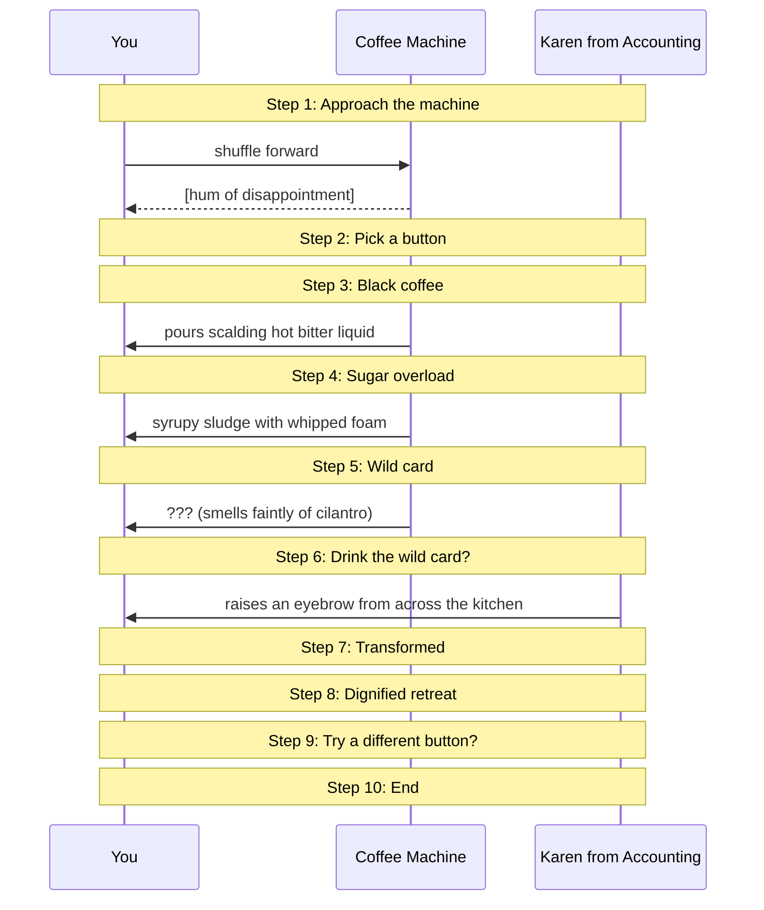

# Office Coffee Crisis

A short choose-your-own-adventure about the morning caffeine ritual

## What you'll learn

- **Approach the machine** — The machine has three buttons. None of them are labelled in any way that inspires confidence.
- **Pick a button** — Black is reliable. Sugar is suspicious. Wild Card is, allegedly, what Karen drinks.
- **Black coffee** — Dependable. Functional. Tastes like burnt cardboard.
- **Sugar overload** — Tastes great for 90 seconds. The crash will be biblical.
- **Transformed** — You are, briefly, a cat. Karen does not seem surprised.

## Flow



## Steps

### Setting the scene

It is 9:01 AM. You did not sleep enough. The standup is in 14 minutes.
You approach the office coffee machine with the focus of a samurai.

### Step 1: Approach the machine

The machine has three buttons. None of them are labelled in any way that inspires confidence.

### Step 2: Pick a button

Black is reliable. Sugar is suspicious. Wild Card is, allegedly, what Karen drinks.

### Step 3: Black coffee

Dependable. Functional. Tastes like burnt cardboard.

### Step 4: Sugar overload

Tastes great for 90 seconds. The crash will be biblical.

### Step 5: Wild card

### Step 6: Drink the wild card?

### Step 7: Transformed

You are, briefly, a cat. Karen does not seem surprised.

### Step 8: Dignified retreat

### Step 9: Try a different button?

### Step 10: End

## Run it

```bash
go run ./examples/basic/
```

Pass `--non-interactive` to skip pauses:

```bash
go run ./examples/basic/ --non-interactive
```
