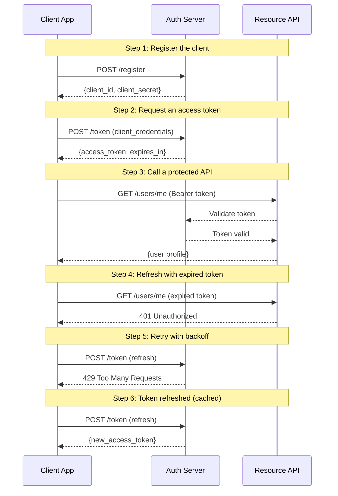

# Token Exchange Flow

How a client obtains and uses an access token

## What you'll learn

- **Register the client** — The auth server issues credentials that the client will use to authenticate.
- **Request an access token** — Using the client_credentials grant, the client exchanges its credentials for a bearer token.
- **Call a protected API** — The API validates the token with the auth server before returning data.
- **Refresh with expired token** — Demonstrates error handling when a token has expired.
- **Retry with backoff** — Demonstrates warning when rate-limited.
- **Token refreshed (cached)** — Demonstrates info result for cache hits.

## Flow



## Steps

### Overview

This example walks through a simplified OAuth-style token exchange.

The client registers, obtains a token, then calls a protected API.

### Step 1: Register the client

> **References:** [RFC 6749 §2](https://www.rfc-editor.org/rfc/rfc6749#section-2)

The auth server issues credentials that the client will use to authenticate.

### Step 2: Request an access token

> **References:** [RFC 6749 §4.4](https://www.rfc-editor.org/rfc/rfc6749#section-4.4)

Using the client_credentials grant, the client exchanges its credentials for a bearer token.

### Step 3: Call a protected API

The API validates the token with the auth server before returning data.

### Step 4: Refresh with expired token

Demonstrates error handling when a token has expired.

### Step 5: Retry with backoff

Demonstrates warning when rate-limited.

### Step 6: Token refreshed (cached)

Demonstrates info result for cache hits.

### What happened

1. The client registered and received credentials.
2. It exchanged those credentials for a short-lived access token.
3. It used that token to call a protected API endpoint.
4. The token expired — the API returned 401 (shown as Error).
5. Refresh was rate-limited (shown as Warning).
6. Token was served from cache (shown as Info).

In production, tokens expire and must be refreshed — but that's a story for another demo.

## References

- [RFC 6749 §2](https://www.rfc-editor.org/rfc/rfc6749#section-2)
- [RFC 6749 §4.4](https://www.rfc-editor.org/rfc/rfc6749#section-4.4)

## Run it

```bash
go run ./examples/basic/
```

Pass `--non-interactive` to skip pauses:

```bash
go run ./examples/basic/ --non-interactive
```
